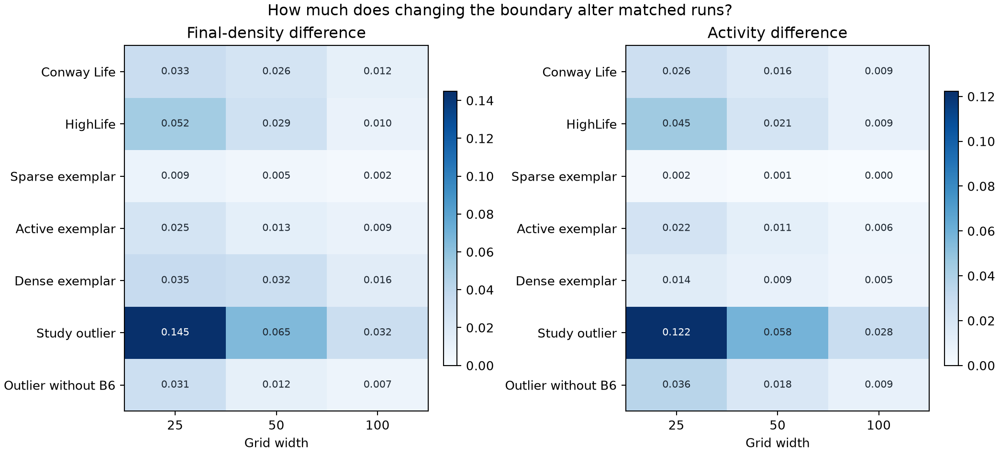
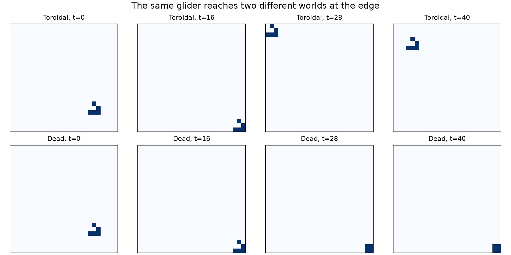
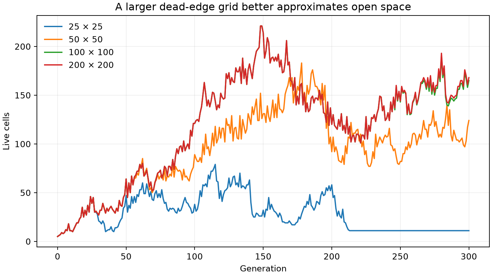
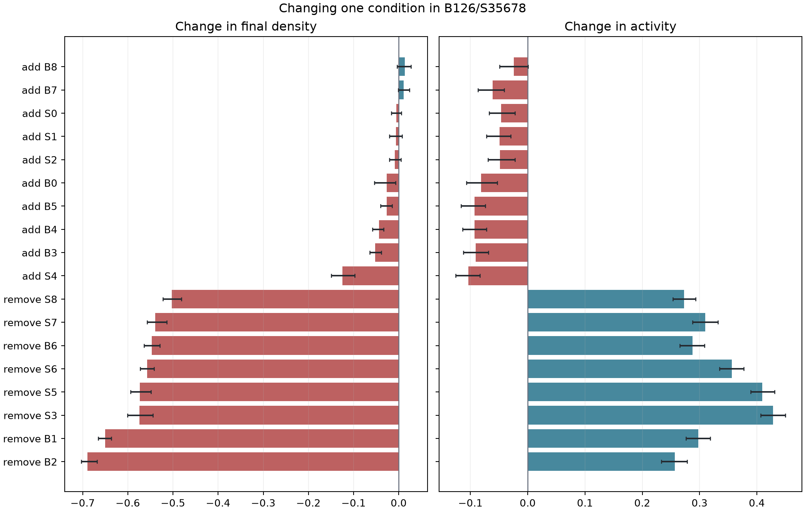

# Follow-up Exploration: Edges, Space, and Rule Changes

The first version of this project treated the grid mostly as a container. George's questions made me reconsider that assumption. What happens at the edge of the grid? Does a larger world reveal the same behavior more reliably? Is the unusual dense rule controlled by one birth condition, or by several conditions working together?

I explored those questions separately from the original rule survey. This report focuses on what I found most interesting rather than listing every result.

## What I tried

I compared seven rules: Conway Life, HighLife, one representative from each of the three behavior groups, the unusual rule `B126/S35678`, and that rule with `B6` removed.

Each rule was tested on grids with widths of 25, 50, and 100 cells. I used both boundary choices now available on the website:

- **Wraparound:** leaving one edge returns a cell to the opposite edge.
- **Dead edge:** every location outside the grid is permanently dead.

For each combination, I used three starting densities and ten matched random starts. A matched start means that the wraparound and dead-edge versions began with exactly the same cells. This made the boundary the only difference between each pair.

I also changed each of the 18 birth and survival conditions in the unusual rule, one at a time. Finally, I followed two small Conway patterns as they encountered the limits of finite grids.

## The edge is part of the world

The effect of the boundary became smaller as the grid grew. Across the seven rules, the average difference in final density was about twice as large on a 25 by 25 grid as on a 50 by 50 grid, then roughly halved again on a 100 by 100 grid.

This pattern makes intuitive sense. A small grid has a large amount of edge compared with its interior. On a larger grid, most cells are far from the boundary, at least early in the run.

The decrease was not equal for every rule. The sparse representative barely noticed the boundary. The unusual dense rule was the most sensitive. On a 25 by 25 grid, dead edges prevented it from filling as much of the world and kept it more active. Its expansion depends on dense neighborhoods reinforcing one another, so a permanently dead exterior interrupts the process.

I had originally thought of boundary handling as a technical setting. I now think it is better understood as part of the environment. A wrapped world has no privileged location. A dead-edge world contains a hostile border. The cells follow the same local rule in both worlds, but they do not live under the same conditions.

## The same glider can keep moving or become trapped

I placed a Conway glider near the lower-right edge of a 25 by 25 grid. With wraparound boundaries, its five-cell pattern crossed the edge, reappeared on the opposite side, and continued moving. With dead edges, part of the glider was cut off. The four remaining cells settled into a stationary block in the corner.

I expected the dead edge to destroy the glider. Instead, it changed a moving object into a stable one. This was more interesting than simple survival or death. The rule did not change, but the environment changed the object's identity.

That matters for the artificial-life interpretation. It is tempting to describe a glider as though movement belongs entirely to the pattern. In reality, the pattern's behavior also depends on the space through which it moves. A claim such as “this object is mobile” quietly assumes a particular kind of world.

## A larger finite grid can act like open space, for a while

An actually infinite grid would require a different representation from the fixed arrays used here. I approximated one by placing an R-pentomino in the center of increasingly large dead-edge grids. I compared each run with a 200 by 200 reference grid.

The population count on the 25 by 25 grid departed from the reference after 28 generations. The 50 by 50 count matched it until generation 56. The 100 by 100 count matched until generation 245. Larger grids preserved the same early population history for longer. They gave the expanding process more time before it encountered an artificial wall.

This helped separate two ideas that can look similar in the interface. Panning changes what the user can see. Increasing or removing the boundary changes what the system can do. A pannable view would be useful, but an open-ended simulation would require storing only the active region and expanding it as needed.

Random experiments also became more repeatable on larger grids. For a fixed rule, density, and boundary, variation between runs usually fell substantially between widths 25 and 100. A small world gives a few chance events a great deal of influence. A larger world contains more local encounters, so its overall measurements are less dependent on any one of them.

## The dense outlier is not controlled by one switch

George suggested that removing `B6` might leave the unusual filling behavior mostly intact. The earlier two-rule comparison showed that it did not. The broader one-bit experiment explained why the rule is more complicated than either interpretation.

Removing `B6` greatly reduced the final population, but removing `B1` or `B2` reduced it even more. Removing any of the rule's survival conditions also broke the nearly full outcome and produced much more activity.

The rule therefore does not appear to have one special “fill the grid” instruction. One plausible reading is that `B1` and `B2` help growth begin around sparse structures, while `B6` helps repair holes once regions become crowded. The survival conditions then keep those dense regions from falling apart. The final behavior seems to come from those stages supporting one another.

The additions were also revealing. Adding permission for more births did not reliably create more cells. Adding `B3`, `B4`, or `B5` slightly lowered the final density and greatly lowered activity. Adding `S4` had an even larger effect: the world changed much less along the way and settled at a lower density than the original rule.

This is a useful warning about reasoning directly from rule notation. A condition that sounds more permissive can redirect the path of the simulation and prevent it from reaching the state that the original rule produced. In a system with feedback, the effect of one condition depends on all the others and on the states the system passes through.

## What I take from this

These experiments changed my view of the original behavior map. The map is useful, but a point on it is not the permanent identity of a rule. It summarizes a rule under chosen grid sizes, boundaries, starting states, and run lengths. Changing the world can move the behavior.

The single-bit experiment also clarified the role of machine learning. Feature importance helped identify rule conditions worth examining, but it could not explain their mechanism. Changing one condition at a time produced a more causal kind of evidence, and it exposed interactions that a ranked importance chart could not show.

For artificial life, the most interesting idea was that a pattern and its environment cannot be completely separated. The glider remained a traveler in one world and became a still life in another. The R-pentomino appeared to grow freely only while it had enough unused space. Robust life-like behavior should probably be tested not only against noise, but also against changes in scale and environment.

## Limits and next questions

This was still a focused exploration. Seven rules cannot describe the entire rule space, and the 200 by 200 grid is only a practical reference, not a true infinite world. The random runs also lasted only 150 generations.

The next question I would pursue is whether some rules remain in the same broad behavior group across grid sizes, boundaries, densities, and noise. Those rules would have a stronger claim to a stable behavioral identity. I would also like to track recognizable objects rather than only population summaries, especially objects that move, split, collide, or reproduce.

The experiment code is in [`analysis/explore_directions.py`](../analysis/explore_directions.py), and the generated measurements are in the [`data`](../data) directory.
