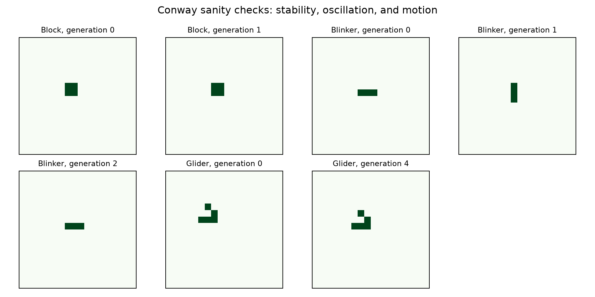
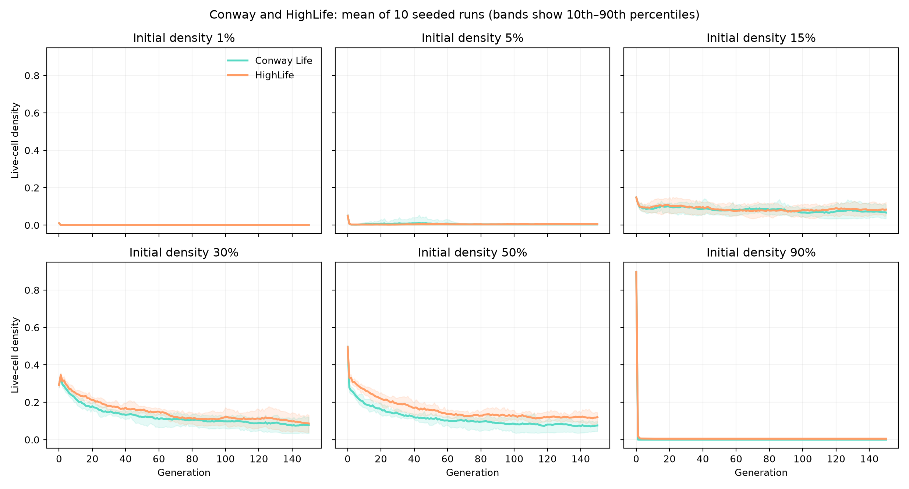
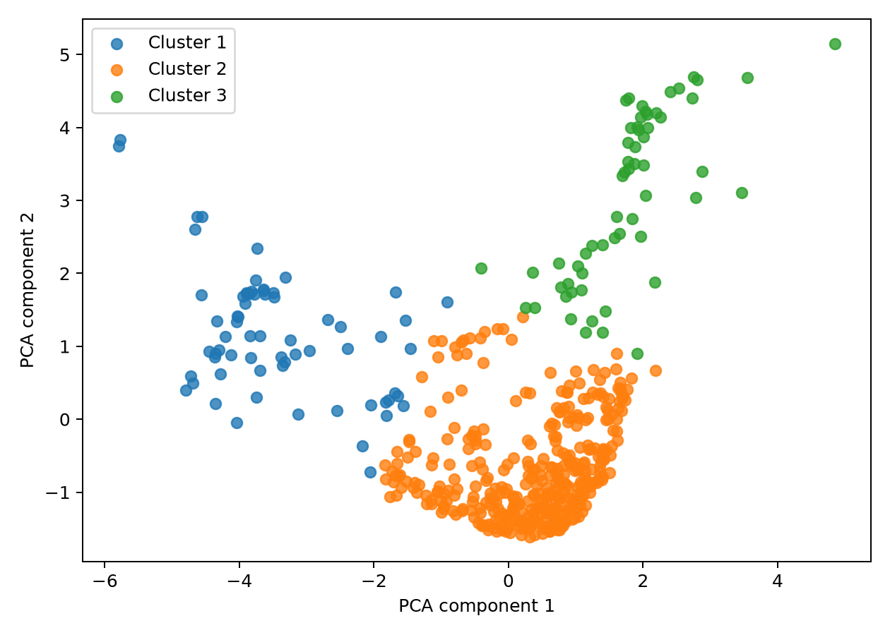
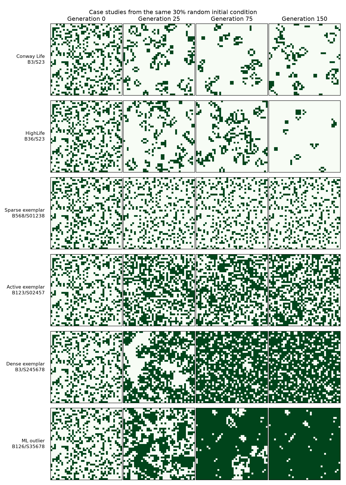
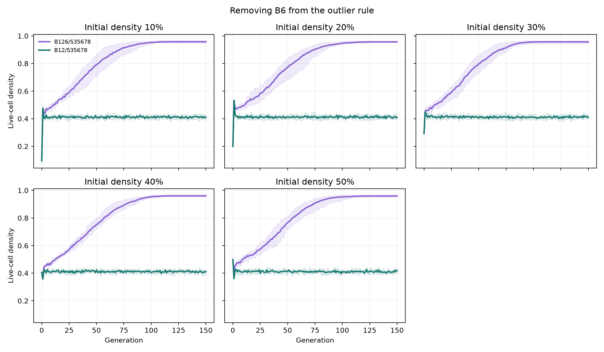
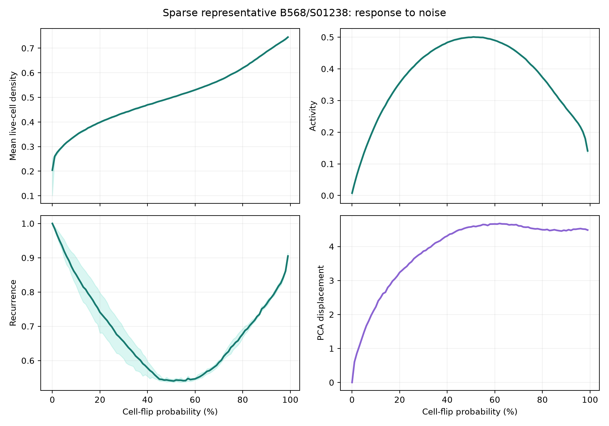
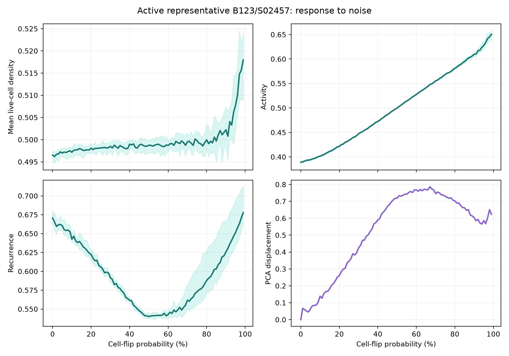
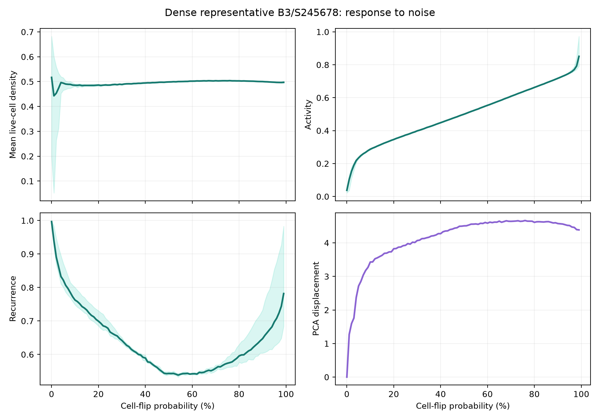

# ML-Guided Discovery of Emergent Cellular Automata

**Emergent Complexity Initial Assignment** 
**Name:** David Lu 
**Date:** September 2026

## Introduction

This project began with a simple question: how can a grid of cells following tiny local rules produce behavior that looks organized, active, or even life-like?

I built an interactive cellular automaton website, then used it as a small research tool. I explored Conway's Game of Life, HighLife, hundreds of other rules, and the effect of random noise. Machine learning helped organize the experiments, but it was not the main subject. Its purpose was to point me toward patterns and rules worth understanding.

Website: <https://davidlutx.github.io/emergent-atlas/> 
Repository: <https://github.com/davidlutx/emergent-atlas>

## What I built

The website contains an adjustable cellular automaton grid. A user can draw cells, run or pause the simulation, step forward, randomize the grid, choose its size and boundary behavior, change its starting density, edit the rule, introduce noise, or load a known starting pattern.

Rules use birth and survival notation. Conway Life is `B3/S23`: a dead cell is born with three live neighbors, while a live cell survives with two or three. HighLife is `B36/S23`, adding birth with six neighbors.

Every cell sees only its eight immediate neighbors. There is no leader, global plan, or cell that knows what the full grid looks like. The interactive simulator can either connect opposite edges or treat everything outside the grid as dead. The batch experiments used connected, or toroidal, edges so that border effects would not influence the comparison between rules.

The website also contains a behavior map made from experiments run in Python. Each point is one rule. Clicking a point shows its measurements and loads that rule into the simulator. This connection was important to me. The analysis did not end at a graph; I could return to the grid and watch the behavior that produced each point.

## Questions

I investigated:

1. How does the starting density affect Conway Life and HighLife?
2. What makes a cellular automaton appear life-like rather than merely random or static?
3. Can simple measurements organize a large collection of rules?
4. Can local birth and survival decisions tell us anything about large-scale behavior?
5. Which behaviors survive random disturbance?

## How I investigated them

I sampled 500 rules. Each rule was run from five random starting states on a 40 by 40 grid for 150 generations. This produced 2,500 main trajectories.

For each trajectory, I recorded eight measurements: mean density, final density, activity, growth, entropy, lifespan, recurrence, and the number of separate live-cell groups. These are incomplete descriptions, but together they distinguish an empty world, a frozen world, a turbulent world, and a world containing many separate structures.

| Measurement | What it captures |
| --- | --- |
| Mean density | The average share of cells alive during the run |
| Final density | The share alive at the last generation |
| Activity | How often cells change between alive and dead |
| Growth | Whether the population generally rises or falls over time |
| Entropy | How balanced the population is between alive and dead, not how it is arranged in space |
| Lifespan | How long the population lasts before becoming empty |
| Recurrence | How closely the grid returns to a recent earlier state |
| Component count | How many separate connected groups of live cells appear |

I averaged the five runs for each rule, producing one row with eight measurements. I standardized each column so that differences in units would not make one measurement dominate. PCA then found the two combinations of those measurements that captured the most variation across the 500 rules. Those two values became the horizontal and vertical coordinates of the behavior map. I used K-means to group nearby rules on the same standardized measurements. K-means does not know what “alive” means. It only groups rules whose measured outcomes are similar.

Finally, I tested whether the rule's 18 birth and survival settings could predict its group. I also added random cell flips after each update to study robustness.

Exact settings and feature formulas are available in [the technical appendix](feature_appendix.md).

## First observations: structure from no controller

I checked the simulator with three known Conway patterns. A block remained still. A blinker repeated every two generations. A glider kept its shape while moving diagonally.

These examples clarified what emergence meant in this project. No cell is programmed to create a block, oscillate, or move. Each cell only counts neighbors. The recognizable object exists at a larger scale than the rule.

The glider felt especially life-like. It maintains an identity while its individual live cells constantly change. The object is not a fixed collection of material. It is a pattern that recreates itself one step farther along the grid. That is closer to how we often think about living systems: persistence through ongoing change, not permanent stillness.

The block is persistent but not active. The blinker is active but trapped in one place. The glider combines persistence, repeated internal change, and motion. This suggested that no single measurement could define artificial life. Density alone says almost nothing about these differences.

## Density and the conditions for interesting behavior

I compared Conway and HighLife across starting grids ranging from almost empty to almost full.

Very sparse grids usually died because cells could not find enough neighbors. Very crowded Conway grids also died, but for the opposite reason: overcrowding. HighLife sometimes preserved a small remnant in crowded conditions because its extra `B6` birth rule created cells that Conway could not.

Moderate densities produced the richest behavior. There were enough interactions for new structures to form, but also enough empty space for boundaries, motion, and separation.

I think these middle densities produced better conditions for artificial life because they balanced contact and independence. With too few cells, nothing can interact. With too many, local structure is swallowed by a nearly uniform mass and then destroyed by overcrowding. Between those extremes, patterns can meet, change, separate, and sometimes persist.

This resembles a broader idea in complex systems: interesting behavior often appears between rigid order and complete disorder. A frozen grid has memory but little change. A random grid has change but little stable identity. Life-like behavior seems to need both.

## What appeared in the larger rule sample

The behavior map separated the sampled rules into three broad groups:

1. Sparse or declining worlds, often broken into many small pieces.
2. Persistent and highly active worlds, with continual turnover.
3. Dense worlds that grew and then changed relatively little.

These groups helped organize the experiments, but none can simply be labeled “alive.”

The sparse group included Conway and HighLife. Sparse does not mean uninteresting. Gliders, oscillators, and other localized structures occupy little of the grid. In fact, empty space may be necessary for distinct objects to exist and move.

The active group looked energetic and unpredictable. This can resemble life, but constant activity is not enough. Pure noise is also active. To call behavior life-like, I would want to see some structure survive inside that activity.

The dense group often produced a nearly uniform live background. It showed growth and persistence, but less visible individuality. A world that fills every available space may be successful by a population measure while being less interesting as artificial life.

This was one of the most useful findings: the largest population was not necessarily the most life-like outcome. Organization, boundaries, motion, and persistence mattered more than sheer cell count.

## What the prediction experiment added

I compared a simple baseline, logistic regression, a decision tree, and a Random Forest. The Random Forest predicted the behavioral group correctly about 86% of the time across repeated train/test splits. The baseline, which always guessed the largest group, reached about 75% but completely failed to recognize the smaller groups.

The exact ranking of models was less important than the general result. The local rule contains real information about the kind of world it tends to create. Survival decisions for crowded neighborhoods were especially useful to the model.

Still, prediction was imperfect. The same rule can behave differently from different initial states. Emergence is therefore not just a property of the rule. It comes from the rule interacting with history and local arrangement.

The feature importance values are associations, not explanations. A survival bit may help prediction without causing a behavior by itself. A better causal experiment would change one bit at a time while holding the initial grid fixed.

## An unusual rule

The behavior map identified `B126/S35678` as the rule farthest from the center of its group. It usually expanded until almost the entire grid was alive.

At first, its growth looked impressive. On closer inspection, the final state seemed less life-like than its expansion. Once the grid became nearly full, there were few separate structures and little meaningful motion. It behaved more like a spreading material than a collection of artificial organisms.

This changed how I interpreted the ML outlier. “Unusual” did not automatically mean “alive.” The model found a statistical exception. Human inspection was still needed to decide what made it interesting.

I also tested whether its `B6` condition was actually unnecessary. I removed only that condition, changing `B126/S35678` to `B12/S35678`, and ran both rules from the same starting grids. The original rule repeatedly filled about 96% of the grid. Without `B6`, the grid instead remained near 41% full and continued changing.

This result suggests that `B6` is central to the filling behavior. As the grid becomes crowded, an empty hole will often have six live neighbors. `B6` fills those holes. The survival conditions then preserve much of the dense region, including cells with eight neighbors. Without `B6`, holes can remain and the rule stays mixed and active. Reading the rule gave a good hypothesis, but changing one condition while keeping the starting states fixed gave a clearer causal answer.

## Noise and robustness

After every normal update, each cell independently had probability \(p\) of flipping from dead to alive or alive to dead. I tested \(p=0\%\) through \(99\%\) in one-percentage-point increments. For each value, I ran ten trials with the same set of starting densities. The three rules were the examples closest to the center of their behavior groups.

The sparse and dense representatives changed strongly as noise was introduced. As the probability approached 50%, both moved toward a mixed population and their normal difference became less distinct. The active representative kept almost the same average density even as individual cells flipped more often. Its large-scale population balance was robust, although its microscopic behavior was not unchanged.

The curves also explain an initially odd result: recurrence was lowest near 50% noise and rose again toward 99%. A 50% flip is maximally unpredictable. Near 100%, almost every cell is flipped, so the disturbance becomes closer to a regular inversion than to random corruption. A higher flip probability above 50% therefore does not mean greater randomness. The curves were smooth enough at one percentage-point resolution to show this shape clearly.

I think robustness is an important part of artificial life. A pattern that exists only under perfect conditions may be interesting mathematically, but living systems must continue despite errors and disturbances. At the same time, robustness should not mean never changing. Living systems often absorb small disruptions while preserving a larger organization.

The active rule may have been robust because its identity was statistical rather than exact. No particular cell arrangement had to survive. This matters when discussing artificial life: a system may preserve an organization without preserving every component. Biological organisms do this as cells and molecules turn over.

This is still a small comparison. Three examples cannot establish that an entire behavior group is robust. It does show why robustness needs more than one definition. Population balance can remain stable while exact arrangements and short-term recurrence change.

## What I learned about artificial life

The project did not produce evidence of full biological life. I did not demonstrate open-ended evolution, heredity, or convincing self-reproduction in the random experiments.

It did show several ingredients associated with artificial life:

- **Self-organization:** large patterns formed without central control.
- **Persistence:** still lifes and oscillators maintained recognizable behavior.
- **Motion:** gliders preserved a pattern while moving.
- **Variation:** different rules and initial states produced different outcomes.
- **Robustness:** some behavioral regimes changed less under noise than others.

The missing ingredient is selection acting on heritable reproduction. Noise creates variation, but variation alone is not evolution. A stronger artificial life system would contain structures that reproduce with occasional changes and compete for space or resources.

My main conclusion is that life-like behavior appears to require a balance. Enough stability to preserve identity. Enough activity to adapt, move, or interact. Enough empty space for separate structures to exist. The local rules create the possibilities, while the initial state and later disturbances determine which possibilities appear.

## AI use

I used AI for planning, code, debugging, experiment design, interface work, and editing. I checked the simulator with known Conway patterns and automated tests. The conclusions came from generated experiment data and visual inspection, not predetermined labels.

AI made a larger investigation possible in a short time. It did not replace understanding the rules, checking correctness, or deciding what the results meant.

## Limitations

- A small sample of the full rule space, with finite starting states and run lengths.
- Behavioral groups depend on the measurements I chose. Other measurements could produce a different map.
- The ML models show patterns and associations, not causal explanations.
- The noise study used one representative per group, so its robustness result is preliminary.
- My features capture population and change better than recognizable shapes, motion, reproduction, or spatial organization.

## Future work

I would focus less on sampling additional random rules and more on structure:

- detect moving objects even when their location changes;
- search for repeated shapes and possible reproduction;
- compare rules that differ by one birth or survival bit;
- test robustness across many examples from each behavioral group;
- introduce multiple states, resources, or inheritance so selection can occur.

The most interesting next question: can a simple rule support persistent structures that reproduce, vary, and remain recognizable under noise?
